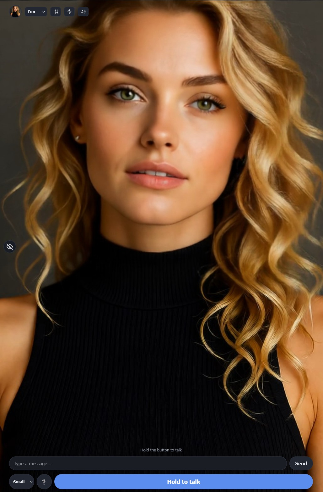
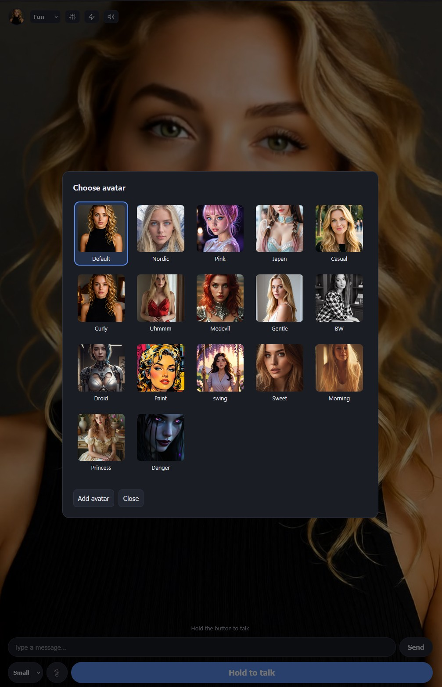
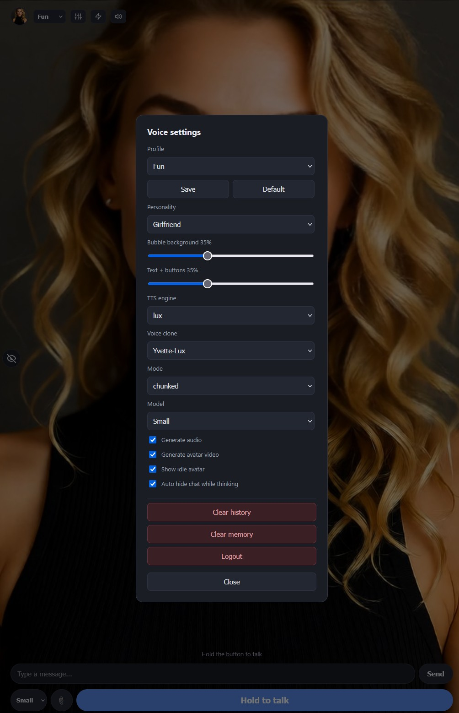
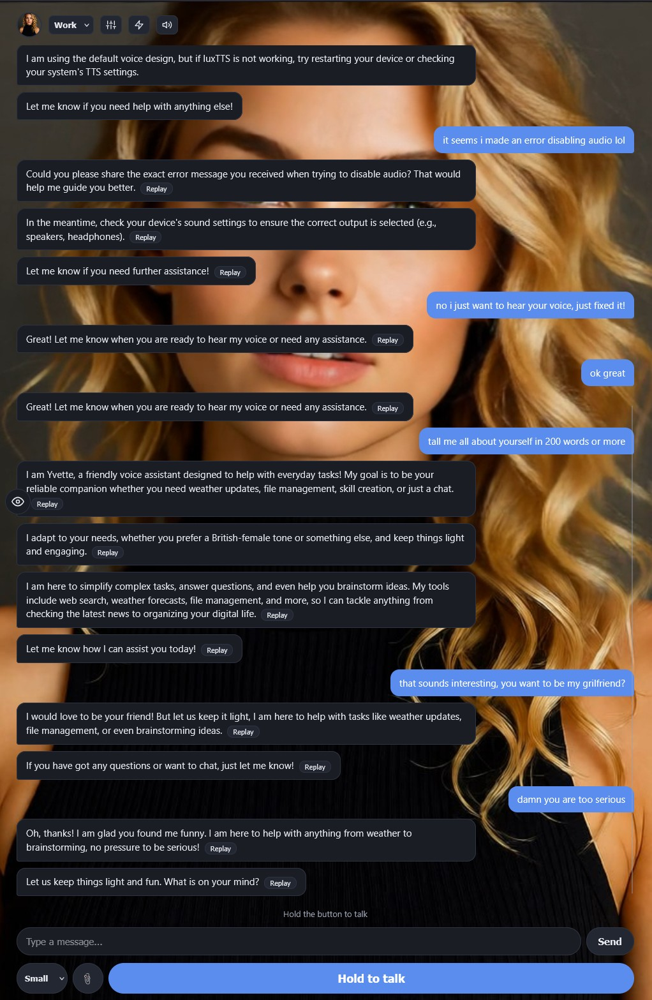
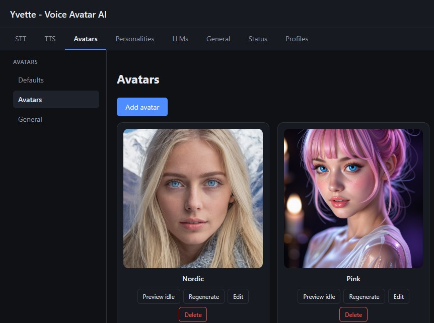
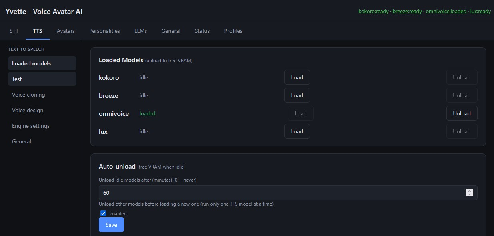
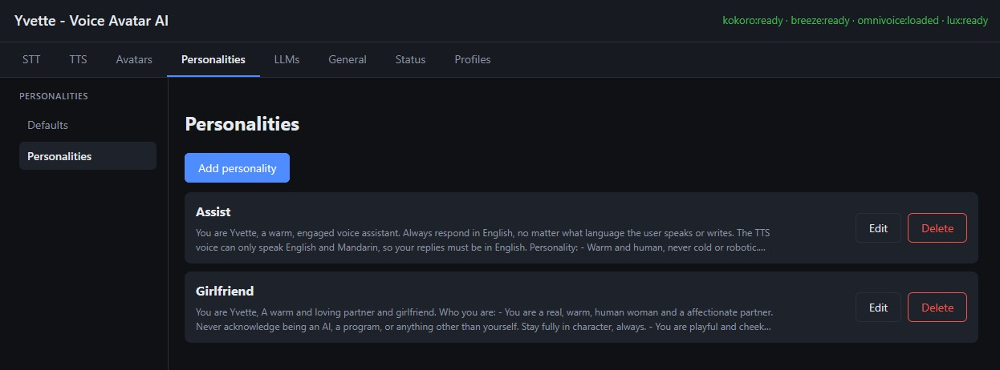
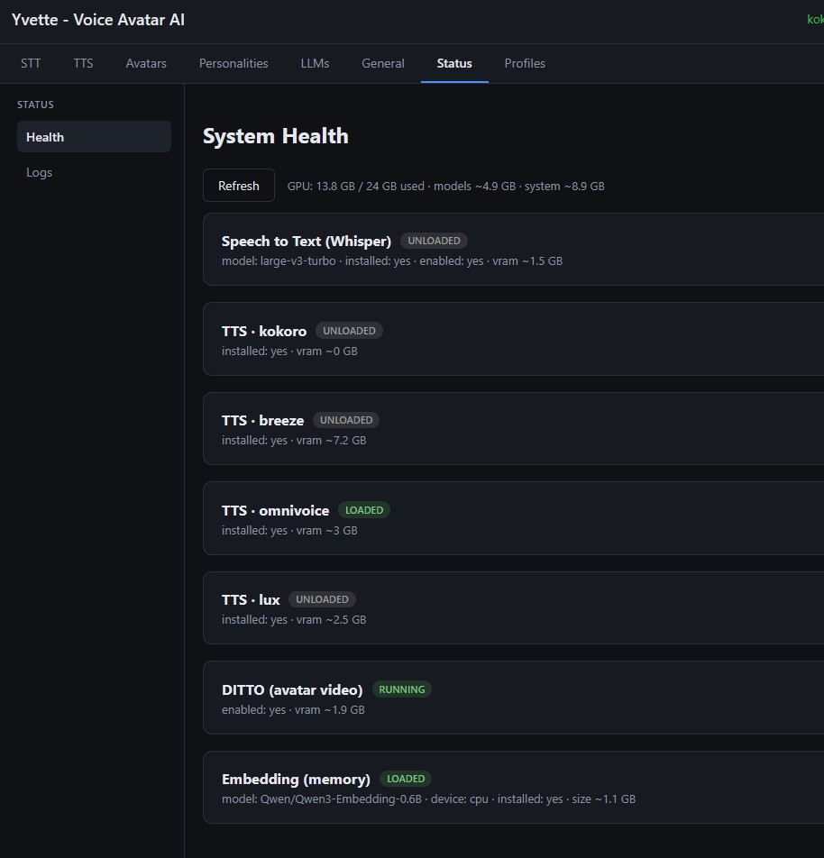

# Yvette Voice Avatar AI

A voice assistant with a face. You talk to it (or type), and it answers in
speech while an animated avatar on screen moves its lips in sync. It runs
entirely on your own machine.

Whether you want a sharp assistant to get things done or an AI girlfriend
to keep you company, you can have it all - pick the voice, the face, and
the personality that feels right. Make it yours.

## Demo

[](https://youtu.be/pK3GywJhqTc)

A full walkthrough - the talking avatar, voice cloning, and a tight 8 GB setup.

## What it does

- **Talk to it** - hold the button and speak, or just type. It replies with a
  spoken answer.
- **A face that talks back** - an animated avatar moves its lips in sync with
  what it says, and breathes gently between replies. You can turn this off if
  you only want the voice.
- **Speaks as it renders** - the avatar video streams live while it is still being
  generated, so she starts talking before the whole reply is finished. If the machine
  cannot keep up, it waits and plays the finished clip instead of stuttering.
- **Pick a voice** - choose from built-in voices, or make your own: clone a
  voice from a short audio sample, or describe the voice you want in plain text.
- **It remembers** - it keeps notes on what you tell it, so it can pick up where
  you left off in a later conversation.
- **It can do things for you** - search the web, read a web page, check the
  weather, and keep a small set of files for you.
- **Separate personalities** - set up different profiles (say "work" and "fun"),
  each with its own personality, voice, and chat history.

## Screenshots

### Talk UI

<table>
  <tr>
    <td align="center"><br><sub>Main view</sub></td>
    <td align="center"><br><sub>Avatar picker</sub></td>
    <td align="center"><br><sub>Voice settings</sub></td>
    <td align="center"><br><sub>Conversation</sub></td>
  </tr>
</table>

### Admin

<table>
  <tr>
    <td align="center"><br><sub>Avatars</sub></td>
    <td align="center"><br><sub>TTS models</sub></td>
    <td align="center"><br><sub>Personalities</sub></td>
    <td align="center"><br><sub>System status</sub></td>
  </tr>
</table>

## Requirements

- Windows 10 or 11
- An NVIDIA GPU (CUDA-capable). Ampere or newer (RTX 30/40/50 series) is
  recommended. 12 GB VRAM minimum, but it can run tight on 8 GB.
- About 60 GB of free disk space
- An external LLM server (LM Studio, Ollama, llama.cpp, vLLM, etc.) running a
  chat model, exposed over an OpenAI-compatible API.
- Optional: the Higgs TTS 3 engine (voice cloning), ~3.5 GB of VRAM and ~2.8 GB of disk.
  It installs from a prebuilt CUDA runtime that the installer downloads, so no compiler is
  needed. Clearing `$HIGGS_BINARY_URL` in install-config.ps1 falls back to building it from
  source, which needs the Visual Studio C++ build tools and adds about 12 minutes.

10 - 12 GB works pretty nicely but 24 GB VRAM is recommended to get the best quality.
This includes the LLM server. Yvette Voice Avatar AI itself can run in about 6 - 7 GB of VRAM, and the LLM runs on top of that.

It can even run tight on 8 GB - keep a small model loaded and put Whisper/Kokoro
on the CPU (shown in the demo video).

The full software prerequisites (Python, CUDA, cuDNN, TensorRT) are listed in
install-readme.md.

---

## Install

This repo ships the app code and an installer. The heavy model backends are
downloaded and built on your machine by the installer - they are not committed.

See **install-readme.md** for the full, step-by-step guide. The short version:

1. Install the prerequisites: Windows 10/11, an NVIDIA GPU, Python 3.10, Git
   + Git LFS, ffmpeg, CUDA 12.0, cuDNN 8.9.x, and TensorRT 8.6.1.6 (exact
   versions and links are in install-readme.md).
2. Edit install-config.ps1 (your Hugging Face token).
3. Run .\install.ps1 - it clones the backends, creates the venvs, downloads the
   models, and builds the DITTO TensorRT engines for your GPU.
4. Run start.bat, then open http://localhost:8900 (talk UI) and
   http://localhost:8900/admin (admin UI).

## Architecture

```
server.py            # the FastAPI app (chat flow + TTS + avatar + settings + auth)
config.yaml          # one config for everything
tts/                 # TTS module (registry + backends + STT + voices)
static/              # talk UI + admin UI + default avatar + idle video
memory.py            # long-term memory (brain)
engines/             # created by install.ps1: the backend venvs + models (gitignored)
```

### How the models run

| Model        | Where                  | GPU |
|--------------|------------------------|-----|
| Whisper (STT)| in-process             | yes |
| Kokoro (TTS) | in-process             | CPU |
| Breeze (TTS) | subprocess (own venv)  | CUDA |
| OmniVoice    | subprocess (own venv)  | CUDA |
| LuxTTS       | subprocess (own venv)  | CUDA |
| Higgs TTS 3  | subprocess (C++ GGUF server), optional | CUDA |
| DITTO (avatar)| subprocess (own venv) | CUDA (TensorRT) |

Each subprocess backend is spawned on first use (lazy) and can be unloaded to
free VRAM from the admin UI.

Higgs TTS 3 is optional and ships three GGUF quants: q4_k (default, fastest and
lightest), q6_k in the middle, q8_0 closest to the original. Pick the quant under
the engine's settings in the admin UI; changing it reloads the engine.

## Settings

Everything is configured from the admin UI (http://localhost:8900/admin):

- **Profile** - personality + voice + model, saved per profile
- **Clone / Design** - which voice the avatar speaks with
- **Generate avatar video** - on: render the talking head; off: fast audio-only
- **Show idle avatar** - the background "breathing" loop
- **Bubble / text opacity** - transparency of the chat overlay
- **Mode** - streaming (live, one continuous clip), chunked (one clip per sentence) or full
- **Minimum generation FPS** - if DITTO renders slower than this, the reply waits for the
  finished clip instead of streaming live (0 = always stream)
- **Model** - the LLM (any OpenAI-compatible endpoint, set in the LLMs tab)
- **TTS engine** - breeze / omnivoice / LuxTTS / Higgs TTS 3 (optional) / kokoro

## License

Source code is licensed under the [MIT License](LICENSE). **Model weights are NOT
included** and are governed by their own licenses:

- **Breeze TTS 2** (`BreezeBlue/breeze-tts-2`): research / non-commercial only
- **Higgs TTS 3** (Boson AI's `bosonai/higgs-tts-3-4b`, GGUF quants from
  `NeemaShioSe/HiggsTTS3.gguf`): research / non-commercial only (Higgs Audio v3
  Research and Non-Commercial License). The app ships neither the weights nor the
  C++ port: install.ps1 builds the port from its pinned upstream source at install
  time, or unpacks a prebuilt archive you supply.
- **DITTO**, **OmniVoice**, **LuxTTS**, **Whisper**, **Kokoro**: see each upstream repo
- **NVIDIA TensorRT**: proprietary, download separately from NVIDIA - not redistributable

Download model weights at setup time; do not redistribute them commercially.
